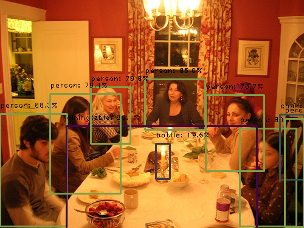
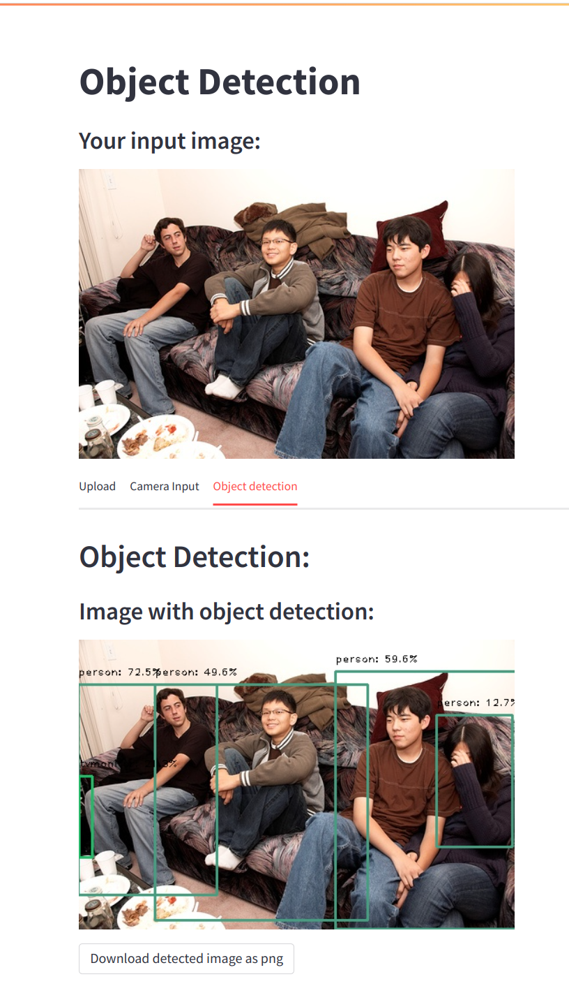

# Object Detection with YOLO-V5 Implementation

This is an exploratory project of [YOLO](https://pjreddie.com/darknet/yolo/), the state-of-the-art real-time 
[object detection](https://en.wikipedia.org/wiki/Object_detection) model. 


## Authors

- Haoxuan Wang [@thomaswang0822](https://www.github.com/thomaswang0822)
- Jingyu Wu [@leowubj](https://github.com/leowubj)

## Screenshots

  
*Image with prediction example*

  
*Our web-app*

## Update 1.0: Video Detection
We include the Video detection feature! 

- To look at a demo result, please visit our [web-app](https://thomaswang0822-yolo-proj-home-j6063r.streamlit.app/) home page.

- To play around with your own video locally, please change the dir and filename in video_runner.py and run it.

- You can also try it out with our web-app. In *video* tab, upload your own mp4 video and do video-object detection with a single click!
**Note: there is a very techinical comptability issue between browser video player and opencv video encoder type (like H264),**
**so we used .webm format as a workaround. This increase the video writing time (numpy ndarray -> video), but model efficiency isn't affected.**


## Roadmap

- Setup the Python environment with GPU enabled.

- Choose a version of YOLO model to use (we have [v5](https://github.com/ultralytics/yolov5))

- (Optional) Collect/Download your custom dataset and do basic data processing.

- Train the model on your custom dataset or popular open source dataset, like COCO dataset.  
    For the latter choice, YOLO repo probably have a script that automates downloading and processing.

- Construct a detection/prediction pipeline that uses the model we have trained.

- Host this pipeline as a web app.
## Usage

If you only want to see how object detection works, you can navigate to our
[web-app](https://thomaswang0822-yolo-proj-home-j6063r.streamlit.app/) directly and upload your image.


## Installation & Explanation

If you want to further explore our project, like to:  
* switch to a different version instead of v5
* train on your choice of dataset
* choose a different model size, see [this](https://en.wikipedia.org/wiki/Object_detection)
* explore deeper to the YOLO

here is an brief guide on how to get everything to work.  

0. ### Presumption: your device has GPU and a Python environment that can use your GPU.
(You can check this in tensorflow or pytorch)

1. ### Clone our repo (or make your own, store your custom dataset, and write corresponding image processing scripts)  
    
    Writing the image processing scripts isn't hard. You can refer to our prepare.ipynb.
    It has enough comment and very likely you only need to change path & filenames.  
    
    The hardest part is manually labeling the datasets not designed for object detection. 
    This means you should draw the bounding boxes (bbox) and type the object class. 
    Labeling can be achieved by package [labelImg](https://pypi.org/project/labelImg/)
    and it's included in our requirements.txt
    
2. ### Clone YOLOv5 or your choice of version inside our repo

```bash
  cd my-project # make sure you enter our repo
  git clone https://github.com/ultralytics/yolov5.git
```
3. ### Install requirements.txt

```bash
  # It contains necessary packages for our project.
  pip install -r requirements.txt

  # It contains necessary packages for playing around with YOLO.
  cd yolo-repo
  pip install -r requirements.txt
```

4. ### Create a data.yaml file inside yolo folder
For contents of this file, you can look at our data.yaml 
(if you use our data and thus our data.yaml, please remember to move it inside yolo folder)  
Essentially, data.yaml tells YOLO where the training data & test data are and what object classes they have.

5. ### Test Training & Training
Since YOLO is a quite complex and delicate model, we suggest you make sure the training is
error-free before you proceed to the actual training (which could take several hours).

```bash
cd yolo-repo

# test training
python train.py --batch-size 8 --epochs 5 --data data.yaml --name <TestModel> --cfg yolov5s.yaml --patience 5

# real training, start from scratch
python train.py --batch-size 8 --epochs 100 --data data.yaml --name <model name> --cfg <choice of model size>.yaml --patience 5 

# real training, on pretrained model
python train.py --batch-size 8 --epochs 100 --data data.yaml --name <model name> --weights <choice of model size>.pt --patience 5 
```
**NOTE:** Like mentioned at the beginning of this section, YOLOv5 (and other versions of YOLO also) has different model size.
In short, different model size means different configurations and parameter size.  
**But larger model doesn't guarantee better performance.** 
Based on our experiment, using a larger model on a relatively samll dataset could lead to worse performance or even not converging.

6. ### Check training performance
```bash
# still inside yolo dir
cd runs/train/<TestModel>
```
This folder contains different training and validation metrics.  
In particular, results.png tells you whether the training works fine.  
For other metrics, you may search them on Google or [YOLOv5 official site](https://github.com/ultralytics/yolov5)

7. ### Export trained model to [ONNX](https://onnx.ai/) format

```bash
# still inside yolo dir
python export.py --weights runs/train/<model name>/weights/best.pt --include onnx --simplify

# either move best.onnx to ROOT or change the path in pred_runner.py (see section below)
mv runs/train/<model name>/weights/best.onnx ./..
```

8. ### Testing
We built the prediction pipeline as a class definition (called Yolo_Predictor) in prediction.py  
This also serves as the backend script of our web-app.  
You are welcome to look at our implementation detail, but you don't need to modify it.

Instead, just edit the path variables inside pred_runner.py and run it, super easy.  
2 pop-up windows will be shown, one being original image, the other being prediction image with bbox, class, and probability.  
Press ESC key and they will close.
```bash
cd .. # back to our repo
python pred_runner.py
```
## References
 - [YOLOv5 official site](https://github.com/ultralytics/yolov5)
 - [Train Custom Data](https://github.com/ultralytics/yolov5/wiki/Train-Custom-Data)